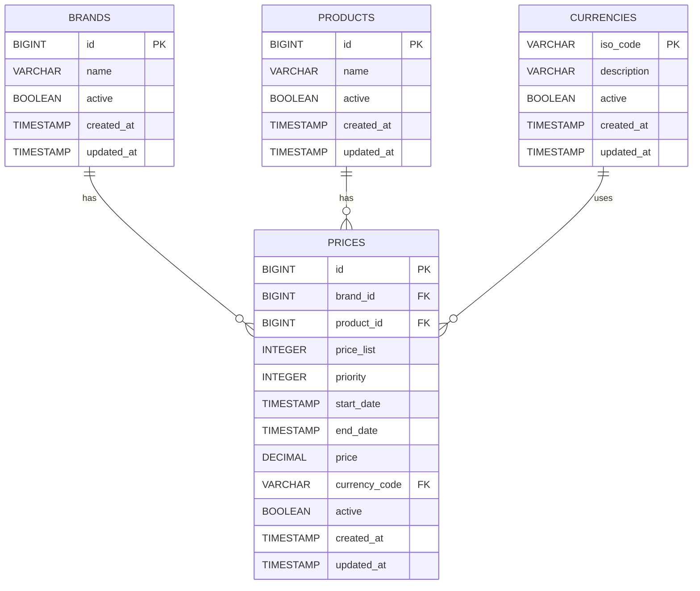

# pricing-engine-retail

Backend service built with **Java 21** and **Spring Boot 3.3.5**, designed to resolve applicable retail prices based on date, product, and brand — following **Hexagonal Architecture**, **Domain-Driven Design**, and modern engineering best practices.

---

## Table of Contents

- [Overview](#overview)
- [Architecture](#architecture)
- [Data Model](#data-model)
- [API Reference](#api-reference)
- [Getting Started](#getting-started)
- [Running Tests](#running-tests)
- [Test Coverage](#test-coverage)
- [Tech Stack](#tech-stack)
- [Project Structure](#project-structure)

---

## Overview

Given a date, a product ID, and a brand ID, the service returns the single applicable price — resolving conflicts by selecting the entry with the highest priority when multiple price windows overlap.

**Core business rule:**

> When two or more price records are valid for the same date and product/brand combination, the one with the highest `priority` value is returned. Only one result is ever returned.

---

## Architecture

The project follows the **Hexagonal Architecture (Ports & Adapters)** pattern, ensuring complete independence between business logic, application orchestration, and infrastructure concerns.

```
┌────────────────────────────────────────────────────────────┐
│                    infrastructure / adapters               │
│                                                            │
│   ┌─────────────┐                       ┌───────────────┐  │
│   │  Adapter IN │                       │  Adapter OUT  │  │
│   │  REST/HTTP  │                       │  JPA / H2     │  │
│   └──────┬──────┘                       └───────┬───────┘  │
│          │                                      │          │
│   ┌──────▼──────────────────────────────────────▼───────┐  │
│   │                    application                      │  │
│   │                                                     │  │
│   │   Port IN: GetApplicablePriceUseCase                │  │
│   │   Port OUT: LoadApplicablePricePort                 │  │
│   │   Service: ApplicablePriceService                   │  │
│   │   Result: ApplicablePriceResult                     │  │
│   │                                                     │  │
│   │   ┌──────────────────────────────────────────────┐  │  │
│   │   │                   domain                     │  │  │
│   │   │  Price · Brand · Product · Currency          │  │  │
│   │   │  AuditMetadata                               │  │  │
│   │   └──────────────────────────────────────────────┘  │  │
│   └─────────────────────────────────────────────────────┘  │
└────────────────────────────────────────────────────────────┘
```

**Dependency direction:** every layer depends only on layers interior to it. The domain knows nothing about the application or infrastructure. The application knows nothing about HTTP or JPA.

### Package structure and responsibilities

| Package | Responsibility |
|---|---|
| `domain.model` | Rich domain records with invariant enforcement (`Price`, `Brand`, `Product`, `Currency`, `AuditMetadata`) |
| `application.ports.in` | Inbound port — defines the use case contract (`GetApplicablePriceUseCase`) |
| `application.ports.out` | Outbound port — defines the persistence contract (`LoadApplicablePricePort`) |
| `application.result` | Use case output type (`ApplicablePriceResult`) — belongs to the application layer, not to infrastructure |
| `application.service` | Use case implementation — orchestrates domain logic, delegates persistence via port |
| `application.exceptions` | Domain-level exceptions (`ApplicablePriceNotFoundException`) |
| `infrastructure.adapters.in.web` | REST controller, request criteria record, response mapping |
| `infrastructure.adapters.in.web.filter` | `CorrelationIdFilter` — injects/propagates `X-Correlation-Id` via MDC |
| `infrastructure.adapters.in.web.handler` | `GlobalExceptionHandler` — maps exceptions to structured HTTP responses |
| `infrastructure.adapters.in.web.response` | HTTP response types (`ApiResponse`, `ApplicablePriceResponse`, `ApiErrorResponse`) |
| `infrastructure.adapters.out.persistence` | JPA repository, persistence adapter, entity-to-domain mapping |
| `infrastructure.adapters.out.persistence.entity` | JPA entities with `AuditableEntity` lifecycle hooks |

---

## Performance & Observability

The service includes basic performance optimizations and observability features to ensure efficient execution and operational visibility.

### Caching (Caffeine)

To improve performance and reduce database load, the applicable price lookup is cached using **Caffeine**.

- Cache name: `applicable-price`
- Key strategy: `applicationDate|productId|brandId`
- Eviction policy:
    - Maximum size: 1,000 entries
    - Expiration: 1 minute after write

The cache is applied at the persistence adapter level using `@Cacheable`, ensuring that repeated queries with identical parameters do not hit the database.

### Query Optimization

The price lookup query is implemented using a **native SQL query**, replacing derived query methods to:

- provide full control over execution
- optimize filtering and ordering
- align with index strategy
- improve performance predictability

### Observability (Micrometer + Actuator)

Basic telemetry is implemented using **Micrometer** and exposed via **Spring Boot Actuator**.

Metrics are collected at the use case level (`ApplicablePriceService`) to capture real business execution behavior.

#### Available metrics

| Metric | Description |
|---|---|
| `pricing.applicable_price.requests` | Total number of requests |
| `pricing.applicable_price.found` | Requests that returned a price |
| `pricing.applicable_price.not_found` | Requests with no applicable price |
| `pricing.applicable_price.validation_error` | Requests rejected due to invalid input |
| `pricing.applicable_price.execution` | Execution time of the use case |

#### Actuator endpoints

- `/actuator/health`
- `/actuator/metrics`
- `/actuator/metrics/pricing.applicable_price.execution`
- `/actuator/caches`

Example:

```bash
curl http://localhost:8080/actuator/metrics/pricing.applicable_price.execution
---

## Data Model

The relational model is structured for referential integrity, auditability, and query efficiency.



**Index strategy:** three indexes are created at startup to support the primary query pattern:

- `idx_prices_brand_product_dates` on `(brand_id, product_id, start_date, end_date)` — covers the main filter
- `idx_prices_priority` on `(priority)` — supports `ORDER BY priority DESC`
- `idx_prices_active` on `(active)` — supports the active flag filter

The database is an **H2 in-memory instance** initialised at startup from `schema.sql` and `data.sql`.

---

## API Reference

### Get applicable price

```
GET /api/v1/prices
```

#### Query parameters

| Parameter | Type | Required | Description |
|---|---|---|---|
| `applicationDate` | `ISO 8601 datetime` | Yes | The date and time to evaluate (e.g. `2020-06-14T10:00:00`) |
| `productId` | `Long` (positive) | Yes | Product identifier |
| `brandId` | `Long` (positive) | Yes | Brand identifier |

All three parameters are mandatory. Missing or invalid values return `400 Bad Request`.

#### Success response — `200 OK`

```json
{
  "message": "Applicable price retrieved successfully",
  "correlationId": "86d7a2fd-9581-4686-ba9b-59ebb8d7183a",
  "payload": {
    "productId": 35455,
    "brandId": 1,
    "priceList": 1,
    "startDate": "2020-06-14T00:00:00",
    "endDate": "2020-12-31T23:59:59",
    "price": 35.50
  }
}
```

#### Error response — `400 Bad Request`

```json
{
  "message": "Invalid request",
  "correlationId": "86d7a2fd-9581-4686-ba9b-59ebb8d7183a",
  "error": {
    "type": "about:blank",
    "title": "Invalid request",
    "status": 400,
    "detail": "Invalid value for parameter: productId",
    "instance": "/api/v1/prices"
  }
}
```

#### Error response — `404 Not Found`

```json
{
  "message": "Resource not found",
  "correlationId": "86d7a2fd-9581-4686-ba9b-59ebb8d7183a",
  "error": {
    "type": "about:blank",
    "title": "Resource not found",
    "status": 404,
    "detail": "No applicable price found for productId=35455, brandId=1, applicationDate=2020-06-17T10:00",
    "instance": "/api/v1/prices"
  }
}
```

#### Correlation ID

Every request and response carries a correlation ID for distributed tracing. Pass `X-Correlation-Id` in the request header to propagate your own ID; if omitted, one is generated automatically and returned in the response header.

```bash
curl -H "X-Correlation-Id: my-trace-id-123" \
  "http://localhost:8080/api/v1/prices?applicationDate=2020-06-14T10:00:00&productId=35455&brandId=1"
```

#### Example requests

```bash
# Test 1 — 2020-06-14 at 10:00 → price list 1 (35.50 EUR)
curl "http://localhost:8080/api/v1/prices?applicationDate=2020-06-14T10:00:00&productId=35455&brandId=1"

# Test 2 — 2020-06-14 at 16:00 → price list 2 (25.45 EUR, higher priority)
curl "http://localhost:8080/api/v1/prices?applicationDate=2020-06-14T16:00:00&productId=35455&brandId=1"

# Test 3 — 2020-06-14 at 21:00 → price list 1 (35.50 EUR, promotional window closed)
curl "http://localhost:8080/api/v1/prices?applicationDate=2020-06-14T21:00:00&productId=35455&brandId=1"

# Test 4 — 2020-06-15 at 10:00 → price list 3 (30.50 EUR)
curl "http://localhost:8080/api/v1/prices?applicationDate=2020-06-15T10:00:00&productId=35455&brandId=1"

# Test 5 — 2020-06-16 at 21:00 → price list 4 (38.95 EUR)
curl "http://localhost:8080/api/v1/prices?applicationDate=2020-06-16T21:00:00&productId=35455&brandId=1"
```

#### H2 Console

Available at `http://localhost:8080/h2-console` while the application is running.

| Field | Value |
|---|---|
| JDBC URL | `jdbc:h2:mem:pricingdb` |
| Username | `sa` |
| Password | _(empty)_ |

---

## Getting Started

### Prerequisites

- Java 21+
- Maven 3.8+

### Clone and run

```bash
git clone https://github.com/gandalfengine/pricing-engine-retail.git
cd pricing-engine-retail
./mvnw spring-boot:run
```

The application starts on port `8080`. The H2 database is initialised automatically with the seed data on every startup.

### Build

```bash
./mvnw clean package
java -jar target/pricing-engine-retail-0.0.1-SNAPSHOT.jar
```

---

## Running Tests

```bash
# Run all tests
./mvnw test

# Run tests and generate JaCoCo coverage report
./mvnw verify

# View coverage report
open target/site/jacoco/index.html
```

---

## Test Coverage

**100% across all metrics** — verified with JaCoCo.

| Layer | Classes | Methods | Lines | Branches |
|---|---|---|---|---|
| `application` | 100% | 100% | 100% | 100% |
| `domain.model` | 100% | 100% | 100% | 100% |
| `infrastructure.adapters` | 100% | 100% | 100% | 100% |
| **Total** | **100%** | **100%** | **100%** | **100%** |

### Test strategy

The test suite is structured in five independent layers, each with a different scope and purpose:

**Domain tests** (`PriceTest`) validate the invariants enforced in the `Price` compact constructor — null fields, invalid date ranges, and correct state exposure via record accessors.

**Use case tests** (`ApplicablePriceServiceTest`) are pure unit tests with Mockito. They cover correct mapping from `Price` to `ApplicablePriceResult`, argument propagation to the outbound port, exception messages, `BigDecimal` precision preservation, and all input validation branches.

**Controller tests** (`PriceQueryControllerTest`) use `MockMvc` with `@WebMvcTest`. They cover all HTTP status codes (200, 400, 404, 500), parameter validation (missing, invalid format, zero, negative), `X-Correlation-Id` propagation, and structured log output via `OutputCaptureExtension`.

**Persistence adapter tests** (`PricePersistenceAdapterTest`) verify entity-to-domain mapping using Mockito mocks — brand, product, currency, audit metadata, and inactive flag are all asserted.

**JPA repository tests** (`PriceJpaRepositoryTest`) run against a real H2 instance with `@DataJpaTest`. They cover the five mandatory scenarios from the challenge specification, plus boundary conditions (inclusive start/end dates, inactive price exclusion via `@Sql`, fallback to base price after a promotional window closes, and empty results for unknown combinations).

**Telemetry tests** validate the correct emission of metrics at the service layer using `SimpleMeterRegistry`, ensuring accurate tracking of request volume, outcomes, and execution time without coupling to infrastructure.
---

## Tech Stack

| Concern | Choice |
|---|---|
| Language | Java 21 |
| Framework | Spring Boot 3.3.5 |
| Persistence | Spring Data JPA + H2 (in-memory) |
| Validation | Jakarta Validation (`@NotNull`, `@Positive`) |
| Logging | SLF4J + Logback with MDC correlation tracking |
| Boilerplate reduction | Lombok |
| Testing | JUnit 5 · Mockito · MockMvc · `@DataJpaTest` |
| Coverage | JaCoCo 0.8.11 |
| Build | Maven 3 |
| Observability | Micrometer + Spring Boot Actuator |
| Caching | Caffeine |
---

## Project Structure

```
src/
├── main/
│   ├── java/com/bcnc/challenge/pricing/
│   │   ├── PricingEngineRetailApplication.java
│   │   ├── application/
│   │   │   ├── exceptions/ApplicablePriceNotFoundException.java
│   │   │   ├── ports/
│   │   │   │   ├── in/GetApplicablePriceUseCase.java
│   │   │   │   └── out/LoadApplicablePricePort.java
│   │   │   ├── result/ApplicablePriceResult.java
│   │   │   └── service/ApplicablePriceService.java
│   │   ├── domain/
│   │   │   └── model/
│   │   │       ├── AuditMetadata.java
│   │   │       ├── Brand.java
│   │   │       ├── Currency.java
│   │   │       ├── Price.java
│   │   │       └── Product.java
│   │   └── infrastructure/
│   │       └── adapters/
│   │           ├── in/web/
│   │           │   ├── PriceQueryController.java
│   │           │   ├── filter/CorrelationIdFilter.java
│   │           │   ├── handler/GlobalExceptionHandler.java
│   │           │   └── response/
│   │           │       ├── ApiErrorResponse.java
│   │           │       ├── ApiResponse.java
│   │           │       └── ApplicablePriceResponse.java
│   │           └── out/persistence/
│   │               ├── PriceJpaRepository.java
│   │               ├── PricePersistenceAdapter.java
│   │               └── entity/
│   │                   ├── AuditableEntity.java
│   │                   ├── BrandEntity.java
│   │                   ├── CurrencyEntity.java
│   │                   ├── PriceEntity.java
│   │                   └── ProductEntity.java
│   │       ├── config/
│   │       │   ├── CacheConfig.java
│   │       │   └── CacheKeyFactory.java
│   └── resources/
│       ├── application.yaml
│       ├── data.sql
│       └── schema.sql
└── test/
    └── java/com/bcnc/challenge/pricing/
        ├── PricingEngineRetailApplicationTest.java
        ├── application/service/ApplicablePriceServiceTest.java
        ├── domain/model/PriceTest.java
        └── infrastructure/adapters/
            ├── in/web/
            │   ├── PriceQueryControllerTest.java
            │   ├── handler/GlobalExceptionHandlerTest.java
            │   └── response/ApiResponseTest.java
            └── out/persistence/
                ├── PriceJpaRepositoryTest.java
                ├── PricePersistenceAdapterTest.java
                └── entity/
                    ├── AuditableEntityTest.java
                    ├── BrandEntityTest.java
                    ├── CurrencyEntityTest.java
                    ├── PriceEntityTest.java
                    └── ProductEntityTest.java
           
```
