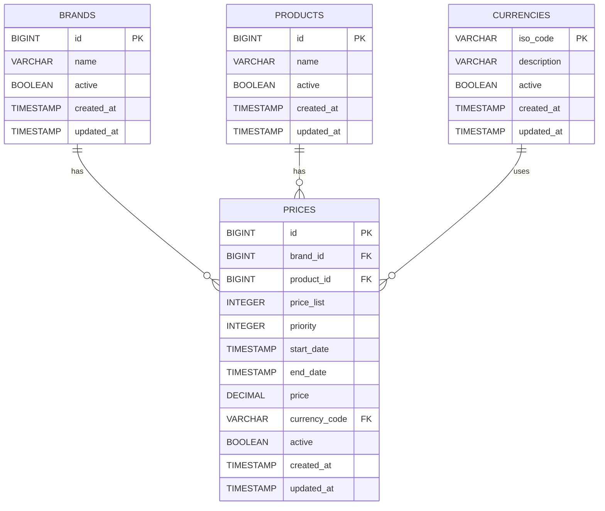

# pricing-engine-retail

Backend service built with **Java 21** and **Spring Boot 3.3.5**, designed to resolve the applicable retail price for a given date, product, and brand — following **Hexagonal Architecture** and **Domain-Driven Design**.

Current project version: **0.1.0-SNAPSHOT**

---

## Table of Contents

- [Overview](#overview)
- [Architecture](#architecture)
- [Data Model](#data-model)
- [API Reference](#api-reference)
- [Configuration by Environment](#configuration-by-environment)
- [Performance & Observability](#performance--observability)
- [Getting Started](#getting-started)
- [Running Tests](#running-tests)
- [Build and Run](#build-and-run)
- [Tech Stack](#tech-stack)
- [Project Structure](#project-structure)

---

## Overview

Given an application date, a product ID, and a brand ID, the service returns the single applicable price — resolving conflicts by selecting the entry with the highest `priority` when multiple price windows overlap.

**Core business rule:**

> When two or more price records are valid for the same date and product/brand combination, the one with the highest `priority` value is returned. Only one result is ever returned.

---

## Architecture

The project follows the **Hexagonal Architecture (Ports & Adapters)** pattern, ensuring complete independence between business logic, application orchestration, and infrastructure concerns.

```text
┌────────────────────────────────────────────────────────────┐
│                    infrastructure / adapters               │
│                                                            │
│   ┌─────────────┐                       ┌───────────────┐  │
│   │  Adapter IN │                       │  Adapter OUT  │  │
│   │  REST/HTTP  │                       │  JPA / H2     │  │
│   └──────┬──────┘                       └───────┬───────┘  │
│          │                                      │          │
│   ┌──────▼──────────────────────────────────────▼───────┐  │
│   │                    application                      │  │
│   │                                                     │  │
│   │   Port IN:  GetApplicablePriceUseCase               │  │
│   │   Port OUT: LoadApplicablePricePort                 │  │
│   │   Service:  ApplicablePriceService                  │  │
│   │   Result:   ApplicablePriceResult                   │  │
│   │                                                     │  │
│   │   ┌──────────────────────────────────────────────┐  │  │
│   │   │                   domain                     │  │  │
│   │   │  Price · Brand · Product · Currency          │  │  │
│   │   │  AuditMetadata                               │  │  │
│   │   └──────────────────────────────────────────────┘  │  │
│   └─────────────────────────────────────────────────────┘  │
└────────────────────────────────────────────────────────────┘
```

**Dependency direction:** every layer depends only on layers interior to it. The domain knows nothing about the application or infrastructure. The application knows nothing about HTTP or JPA.

### Package responsibilities

| Package | Responsibility |
|---|---|
| `domain.model` | Rich domain records with invariant enforcement (`Price`, `Brand`, `Product`, `Currency`, `AuditMetadata`) |
| `application.ports.in` | Inbound port — defines the use case contract (`GetApplicablePriceUseCase`) |
| `application.ports.out` | Outbound port — defines the persistence contract (`LoadApplicablePricePort`) |
| `application.result` | Use case output type (`ApplicablePriceResult`) |
| `application.service` | Use case implementation — orchestrates domain logic and delegates persistence via port |
| `application.exceptions` | Domain-level exceptions (`ApplicablePriceNotFoundException`) |
| `infrastructure.adapters.in.web` | REST controller, request criteria record, and response mapping |
| `infrastructure.adapters.in.web.filter` | `CorrelationIdFilter` — injects and propagates `X-Correlation-Id` via MDC |
| `infrastructure.adapters.in.web.handler` | `GlobalExceptionHandler` — maps exceptions to structured HTTP responses |
| `infrastructure.adapters.in.web.response` | HTTP response types (`ApiResponse`, `ApplicablePriceResponse`, `ApiErrorResponse`) |
| `infrastructure.adapters.out.persistence` | JPA repository, persistence adapter, and entity-to-domain mapping |
| `infrastructure.adapters.out.persistence.entity` | JPA entities with `AuditableEntity` lifecycle hooks |
| `infrastructure.config` | Caffeine cache configuration and cache key factory |

---

## Data Model

The relational model is structured for referential integrity, auditability, and query efficiency.



**Index strategy:** a composite index is created to support the primary query pattern:

- `idx_prices_search` on `(brand_id, product_id, active, start_date, end_date, priority)`

### Database initialization

The application now uses **Flyway** to version and execute database migrations.

Migration files are located at:

```text
src/main/resources/db/migration
```

Current migrations:

- `V1__create_pricing_schema.sql`
- `V2__seed_pricing_data.sql`

Flyway stores execution history in the `flyway_schema_history` table.

Useful query:

```sql
SELECT * FROM flyway_schema_history ORDER BY installed_rank;
```

In the `dev` profile, the application uses an **H2 in-memory database**, so migrations are executed on every startup because the database is recreated each time the process starts.

---

## API Reference

### Get applicable price

```text
GET /api/v1/prices
```

### Query parameters

| Parameter | Type | Required | Description |
|---|---|---|---|
| `applicationDate` | `ISO 8601 datetime` | Yes | The date and time to evaluate (e.g. `2020-06-14T10:00:00`) |
| `productId` | `Long` (positive) | Yes | Product identifier |
| `brandId` | `Long` (positive) | Yes | Brand identifier |

All three parameters are mandatory. Missing or invalid values return `400 Bad Request`.

### Success response — `200 OK`

```json
{
  "message": "Applicable price retrieved successfully",
  "correlationId": "86d7a2fd-9581-4686-ba9b-59ebb8d7183a",
  "payload": {
    "productId": 35455,
    "brandId": 1,
    "priceList": 1,
    "startDate": "2020-06-14T00:00:00",
    "endDate": "2020-12-31T23:59:59",
    "price": 35.50
  }
}
```

### Error response — `400 Bad Request`

```json
{
  "message": "Invalid request",
  "correlationId": "86d7a2fd-9581-4686-ba9b-59ebb8d7183a",
  "error": {
    "type": "about:blank",
    "title": "Invalid request",
    "status": 400,
    "detail": "Invalid value for parameter: productId",
    "instance": "/api/v1/prices"
  }
}
```

### Error response — `404 Not Found`

```json
{
  "message": "Resource not found",
  "correlationId": "86d7a2fd-9581-4686-ba9b-59ebb8d7183a",
  "error": {
    "type": "about:blank",
    "title": "Resource not found",
    "status": 404,
    "detail": "No applicable price found for productId=35455, brandId=1, applicationDate=2020-06-17T10:00",
    "instance": "/api/v1/prices"
  }
}
```

### Correlation ID

Every request and response carries a correlation ID for traceability. Pass `X-Correlation-Id` in the request header to propagate your own ID; if omitted, one is generated automatically and returned in the response header.

```bash
curl -H "X-Correlation-Id: my-trace-id-123"   "http://localhost:8080/api/v1/prices?applicationDate=2020-06-14T10:00:00&productId=35455&brandId=1"
```

### Example requests

```bash
curl "http://localhost:8080/api/v1/prices?applicationDate=2020-06-14T10:00:00&productId=35455&brandId=1"
curl "http://localhost:8080/api/v1/prices?applicationDate=2020-06-14T16:00:00&productId=35455&brandId=1"
curl "http://localhost:8080/api/v1/prices?applicationDate=2020-06-14T21:00:00&productId=35455&brandId=1"
curl "http://localhost:8080/api/v1/prices?applicationDate=2020-06-15T10:00:00&productId=35455&brandId=1"
curl "http://localhost:8080/api/v1/prices?applicationDate=2020-06-16T21:00:00&productId=35455&brandId=1"
```

### H2 Console

Available only in the `dev` profile at:

```text
http://localhost:8080/h2-console
```

| Field | Value |
|---|---|
| JDBC URL | `jdbc:h2:mem:pricingdb` |
| Username | `sa` |
| Password | *(empty by default)* |

---

## Configuration by Environment

The project is now organised by Spring profiles:

- `application.yaml` → shared base configuration
- `application-dev.yaml` → local development
- `application-hom.yaml` → homologation
- `application-prod.yaml` → production

### Environment variables

The application supports environment variables for database configuration.

Examples:

- `DB_URL`
- `DB_USERNAME`
- `DB_PASSWORD`
- `DB_DRIVER`
- `DB_POOL_MAX_SIZE`
- `DB_POOL_MIN_IDLE`
- `DB_CONNECTION_TIMEOUT`
- `DB_IDLE_TIMEOUT`

For local development, default values are already provided in the `dev` profile when possible.

---

## Performance & Observability

### Caching (Caffeine)

Applicable price lookups are cached at the persistence adapter level using **Caffeine** and Spring's `@Cacheable`.

| Setting | Value |
|---|---|
| Cache name | `applicable-price` |
| Key | `applicationDate|productId|brandId` |
| Max size | 1,000 entries |
| Expiration | 1 minute after write |

### Query Optimisation

The price lookup uses a **native SQL query** rather than a derived JPA method. This gives full control over filtering, ordering, and index alignment.

```sql
SELECT p.*
FROM prices p
WHERE p.product_id = :productId
  AND p.brand_id   = :brandId
  AND p.active     = true
  AND p.start_date <= :applicationDate
  AND p.end_date   >= :applicationDate
ORDER BY p.priority DESC, p.start_date DESC
LIMIT 1
```

### Observability (Micrometer + Actuator)

Metrics are collected at the service layer to capture business execution behaviour.

| Metric | Description |
|---|---|
| `pricing.applicable_price.requests` | Total number of requests received |
| `pricing.applicable_price.found` | Requests that returned a price |
| `pricing.applicable_price.not_found` | Requests with no applicable price |
| `pricing.applicable_price.validation_error` | Requests rejected due to invalid input |
| `pricing.applicable_price.execution` | Execution time of the use case |

### Actuator endpoints

Base path:

```text
/manage
```

Examples:

```bash
curl http://localhost:8080/manage/health
curl http://localhost:8080/manage/metrics
curl http://localhost:8080/manage/metrics/pricing.applicable_price.execution
curl http://localhost:8080/manage/caches
```

Endpoint exposure varies by profile.

---

## Getting Started

### Prerequisites

- Java 21+
- Maven 3.8+

### Clone the project

```bash
git clone https://github.com/gandalfengine/pricing-engine-retail.git
cd pricing-engine-retail
```

---

## Running Tests

Because the project now uses profile-based configuration, tests should be executed with the appropriate Spring profile.

### Run all tests

```bash
./mvnw clean test -Dspring.profiles.active=dev
```

or

```bash
SPRING_PROFILES_ACTIVE=dev ./mvnw clean test
```

### Run tests with verification and JaCoCo report

```bash
./mvnw clean verify -Dspring.profiles.active=dev
```

or

```bash
SPRING_PROFILES_ACTIVE=dev ./mvnw clean verify
```

JaCoCo runs in the `verify` phase.

---

## Build and Run

### Build the application

```bash
./mvnw clean package -Dspring.profiles.active=dev
```

or

```bash
SPRING_PROFILES_ACTIVE=dev ./mvnw clean package
```

### Generated artifact

The final artifact is generated as:

```text
target/pricing-engine-retail.jar
```

### Run with `dev` profile

```bash
java -jar target/pricing-engine-retail.jar --spring.profiles.active=dev
```

### Run with `hom` profile

```bash
java -jar target/pricing-engine-retail.jar --spring.profiles.active=hom
```

### Run with `prod` profile
The prod profile requires database connection variables to be provided explicitly.
```bash
DB_URL="jdbc:h2:mem:pricingdb;DB_CLOSE_DELAY=-1;DB_CLOSE_ON_EXIT=FALSE" \
DB_DRIVER="org.h2.Driver" \
DB_USERNAME="sa" \
DB_PASSWORD="" \
DB_POOL_MAX_SIZE="5" \
DB_POOL_MIN_IDLE="1" \
DB_CONNECTION_TIMEOUT="30000" \
DB_IDLE_TIMEOUT="600000" \
java -jar target/pricing-engine-retail.jar --spring.profiles.active=prod
```
Example above uses H2 only to validate the prod profile locally. In a real production environment, these values should point to the actual database and driver.
### Run directly with Spring Boot

```bash
SPRING_PROFILES_ACTIVE=dev ./mvnw spring-boot:run
```

---

## Tech Stack

| Concern | Choice |
|---|---|
| Language | Java 21 |
| Framework | Spring Boot 3.3.5 |
| Persistence | Spring Data JPA + H2 |
| Database migrations | Flyway |
| Caching | Caffeine |
| Validation | Jakarta Validation |
| Logging | SLF4J + Logback with MDC correlation tracking |
| Observability | Micrometer + Spring Boot Actuator |
| Boilerplate reduction | Lombok |
| Testing | JUnit 5 · Mockito · MockMvc · `@DataJpaTest` · `@SpringBootTest` |
| Coverage | JaCoCo 0.8.11 |
| Build | Maven 3 |

---

## Project Structure

```text
src/
├── main/
│   ├── java/com/bcnc/challenge/pricing/
│   │   ├── PricingEngineRetailApplication.java
│   │   ├── application/
│   │   │   ├── exceptions/
│   │   │   │   └── ApplicablePriceNotFoundException.java
│   │   │   ├── ports/
│   │   │   │   ├── in/GetApplicablePriceUseCase.java
│   │   │   │   └── out/LoadApplicablePricePort.java
│   │   │   ├── result/ApplicablePriceResult.java
│   │   │   └── service/ApplicablePriceService.java
│   │   ├── domain/
│   │   │   └── model/
│   │   │       ├── AuditMetadata.java
│   │   │       ├── Brand.java
│   │   │       ├── Currency.java
│   │   │       ├── Price.java
│   │   │       └── Product.java
│   │   └── infrastructure/
│   │       ├── adapters/
│   │       │   ├── in/web/
│   │       │   │   ├── PriceQueryController.java
│   │       │   │   ├── filter/CorrelationIdFilter.java
│   │       │   │   ├── handler/GlobalExceptionHandler.java
│   │       │   │   └── response/
│   │       │   │       ├── ApiErrorResponse.java
│   │       │   │       ├── ApiResponse.java
│   │       │   │       └── ApplicablePriceResponse.java
│   │       │   └── out/persistence/
│   │       │       ├── PriceJpaRepository.java
│   │       │       ├── PricePersistenceAdapter.java
│   │       │       └── entity/
│   │       │           ├── AuditableEntity.java
│   │       │           ├── BrandEntity.java
│   │       │           ├── CurrencyEntity.java
│   │       │           ├── PriceEntity.java
│   │       │           └── ProductEntity.java
│   │       └── config/
│   │           ├── CacheConfig.java
│   │           └── CacheKeyFactory.java
│   └── resources/
│       ├── application.yaml
│       ├── application-dev.yaml
│       ├── application-hom.yaml
│       ├── application-prod.yaml
│       └── db/
│           └── migration/
│               ├── V1__create_pricing_schema.sql
│               └── V2__seed_pricing_data.sql
└── test/
    └── java/com/bcnc/challenge/pricing/
        ├── PricingEngineRetailApplicationTest.java
        ├── application/
        │   └── service/
        │       ├── ApplicablePriceServiceTest.java
        │       └── ApplicablePriceServiceTelemetryTest.java
        ├── domain/
        │   └── model/PriceTest.java
        └── infrastructure/
            ├── adapters/
            │   ├── in/web/
            │   │   ├── PriceQueryControllerTest.java
            │   │   ├── handler/GlobalExceptionHandlerTest.java
            │   │   └── response/ApiResponseTest.java
            │   └── out/persistence/
            │       ├── PriceJpaRepositoryTest.java
            │       ├── PricePersistenceAdapterCacheIT.java
            │       ├── PricePersistenceAdapterTest.java
            │       └── entity/
            │           ├── AuditableEntityTest.java
            │           ├── BrandEntityTest.java
            │           ├── CurrencyEntityTest.java
            │           ├── PriceEntityTest.java
            │           └── ProductEntityTest.java
            └── config/
                ├── CacheConfigTest.java
                └── CacheKeyFactoryTest.java
```
